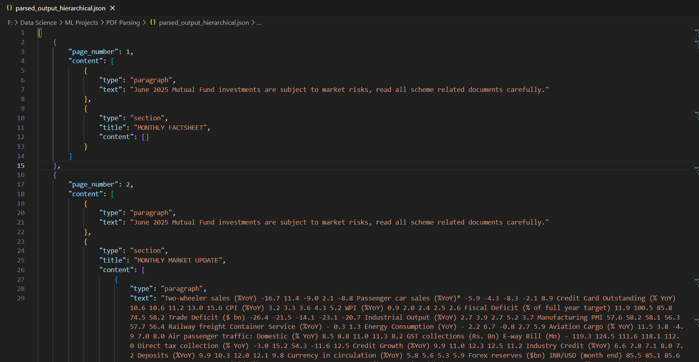

# 📄 PDF Parsing to Structured JSON

Extract text from a PDF 📑 and convert it into a **well-structured JSON** 🗂️ format.

---

## 📌 Table of Contents

* [✨ Overview](#-overview)
* [⚡ Features](#-features)
* [📂 Folder Structure](#-folder-structure)
* [🛠️ Requirements](#️-requirements)
* [⚙️ Installation](#-installation)
* [▶️ Usage](#️-usage)
* [📊 JSON Output Format](#-json-output-format)
* [📸 Screenshots](#-screenshots)
* [🔮 Limitations & Future Work](#-limitations--future-work)
* [🤝 Contributing](#-contributing)
* [🌐 Connect with Me](#-connect-with-me)

---

## ✨ Overview

This project lets you **parse any PDF** and convert it into a **hierarchical JSON structure**.
Instead of dumping all the text, it groups the content into **pages, sections, and paragraphs**, making it easy to process further 🔍.

---

## ⚡ Features

✔️ Parse multi-page PDFs
✔️ Preserve page numbers
✔️ Group text into blocks / paragraphs
✔️ Optional heading / section detection
✔️ Clean & readable JSON output

---

## 📂 Folder Structure

```
Pdf-Parsing-in-json-format/
├── Assignment Task_ PDF Parsing.pdf
├── PDF Parsing and Structured JSON.py
├── [Fund Factsheet - May]360ONE-MF-May 2025.pdf.pdf
├── parsed_output_hierarchical.json
├── screenshots/
│   └── output_sample.png
└── README.md
```

---

## 🛠️ Requirements

* Python 3.7+ 🐍
* PDF libraries (`pdfminer.six` or `pdfplumber`)
* JSON library (built-in)

Install dependencies:

```bash
pip install pdfminer.six
# or
pip install pdfplumber
```

---

## ⚙️ Installation

1. Clone the repo:

   ```bash
   git clone https://github.com/mangal-singh001/Pdf-Parsing-in-json-format.git
   cd Pdf-Parsing-in-json-format
   ```

2. (Optional) Create a virtual environment:

   ```bash
   python -m venv venv
   source venv/bin/activate   # Linux / macOS  
   venv\Scripts\activate      # Windows
   ```

3. Install dependencies:

   ```bash
   pip install -r requirements.txt
   ```

---


## ▶️ Usage

Run the script with an input PDF and optional output JSON:

```bash
python "PDF Parsing and Structured JSON.py" input.pdf output.json
```

---

## 📊 JSON Output Format

The output JSON contains:

* **filename**: input PDF name
* **num_pages**: total pages
* **pages**: each page with extracted blocks (paragraphs, sections, etc.)

---

## 📸 Screenshots

Here’s a sample output JSON structure displayed in VS Code:



---

## 🔮 Limitations & Future Work

⚠️ Current Limitations:

* No OCR (works only on text-based PDFs)
* Limited handling of tables & images
* Heading detection is heuristic-based

✨ Future Enhancements:

* OCR support for scanned PDFs 🖼️
* Table & chart extraction 📊
* Better heading/section classification

---

## 🤝 Contributing

Want to improve this project? 🙌

1. Fork the repo
2. Create a branch (`git checkout -b feature-name`)
3. Commit changes
4. Push & open a Pull Request

---

## 🌐 Connect with Me

* 💼 [LinkedIn](https://www.linkedin.com/in/mangal-singh001)
* 💻 [GitHub](https://github.com/mangal-singh001)

---

⭐ If you found this project helpful, don’t forget to **star the repo** and support the journey 🚀

---

